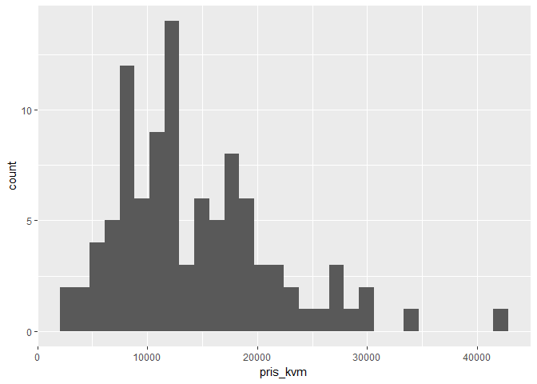

# Webscrape Boliga
Kenneth Rose  
1. aug. 2015  

This package has a few helper functions to webscrape the content of boliga.

It is rather simple to use. You only need to do the following to scrape the actual sales
prices for an area that you define on the [boliga](www.boliga.dk) homepage. You only 
need to do the following:

- Go to quick search page on [boliga.dk/salg](www.boliga.dk/salg)
- Make an appropiate search
- Copy the url into the function boliga_webscrape_sold.

Clap your hands when the data is returned.


```r
library(boliga)
library(ggplot2)
library(ggmap)
library(dplyr)

# The url is from boliga.dk/salg -> 
# Hurtigsøgning:boligtype(fritdishuse), hurigsøgning:postnummer(4500) and then press "søg"
# Jeg har splittet url'en op i paste0 fordi at den er så lang.

boliger <- boliga_webscrape_sold(url_address = paste0("http://www.boliga.dk/salg/resultater?so=1&",
                                                      "sort=omregnings_dato-d&maxsaledate=today&",
                                                      "type=Fritidshus&iPostnr=4500&",
                                                      "gade=&minsaledate=2016"))

# boliger <- webscrape_boliga_sold(url_address = "http://www.boliga.dk/salg/resultater?so=1&type=Fritidshus&kom=&fraPostnr=&tilPostnr=&gade=&min=&max=&byggetMin=&byggetMax=&minRooms=&maxRooms=&minSize=&maxSize=&minsaledate=2014&maxsaledate=today&kode=")
```

I just bought a summer house in Nykøbing Sj. so let's see how the distribution of prices are now
compared to the price I payed for the house.


```r
hist(boliger$pris_kvm, 
     xlab = "kvm pris", 
     ylab = "antal",
     breaks = 50, 
     main = "Histogram af kvm priser")
abline(v = 535000 / 126)
abline(v = 735000 / 126)
```

\

Phew... That's not to bad!


But what if my area is clusted with low square meter prices? Let's use the ggmap package to the lat/lon from the address.


```r
# Second, clean the address
boliger$adresse <- paste(boliger$vej, boliger$post_by)
boliger$adresse <- paste0(boliger$adresse, ", Denmark")

# Get the lon and lat from google
# THIS WILL TAKE A WHILE
latlon <- geocode(location = boliger$adresse)
boliger <- cbind(boliger, latlon)
```

